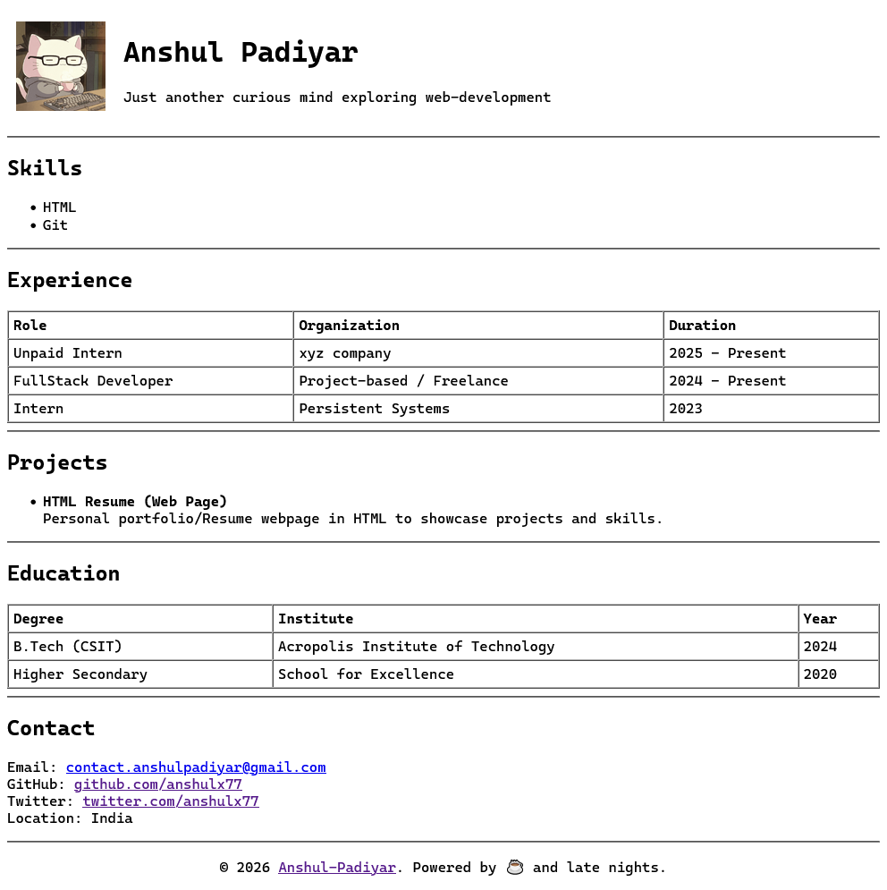

# HTML Resume Project

This single-page resume website as a part of my assignment to demonstrate core HTML skills. The main challenge here was to create a proper professional layout without using any CSS, style tags or inline styling.

To keep the structure clean and well aligned, I have used HTML tables for the header and data sections. I have focused on using proper semantic tags and attributes to ensure the resume looks organized and is easy to read. This project shows how we can handle web structure and spacing using only basic HTML elements.

## Tag and Attributes I used

### Tags:
- `<section>`: To wrap and categorize different resume modules.
- `<table>`, `<thead>`, `<tbody>`, `<tr>`, `<th>`, `<td>`: Used for structured data display and the profile header layout.
- `<ul>`, `<li>`: To list skills and project details.
- `<h1>`, `<h2>`: For establishing a clear visual hierarchy.
- `
`, `<strong>`, ` `, `
`: For text flow, emphasis, and section separation.
- `<a>`, ``: For contact links and profile picture integration.
- `<footer>`, `
`: For the copyright notice and final alignment.

### Attributes:
- `width="100%"`: To ensure tables span the full width of the viewport.
- `cellpadding`: To provide internal padding within table cells for readability.
- `cellspacing="0"`: To remove default gaps between table cells.
- `align="center"` and `align="left"`: To control the positioning of the avatar and table text.
- `border="1"`: To define visible boundaries for the Experience and Education tables.

---

## Link

You can view the live version of the project here:
- GitHub pages: [anshulx77.github.io/HTML-Resume](https://anshulx77.github.io/HTML-Resume/)
- Vercel: [html-resume-ap.vercel.app](https://html-resume-ap.vercel.app/)

---

## Screenshot

